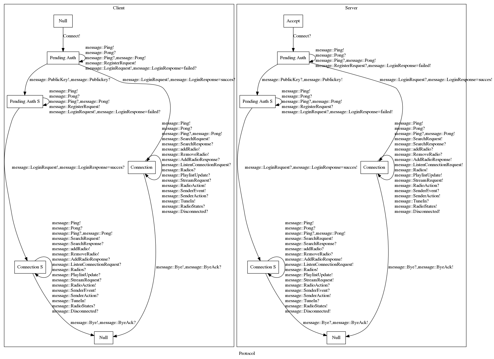

DMP
===

Distributed Music Player

The network protocol
===================

Each message passed over the TCP control connection has the following format

|A network packet| | | | |
|---|---|---|---|---|
| 1 byte | 4 bytes | 1 byte | 4 bytes | size bytes |
| encryption sentinel | possibly encrypted message::Type | encryption sentinel | size of message uint32_t | possibly encrypted message |

* The encryption sentinels are either 0 or 1, for unencrypted and encrypted respectively.
* The Type is a uint32_t which can be casted to a message::Type
* The size of the message is a uint32_t and is the size of the message in bytes.
* The message is a custom Archive format, which serializes structs with boost::fusion.

For the time being all these components are sent separately resulting in 5 network packets. This is somewhat inefficient, it could be reduced quite easily to 1 packet when sending unencrypted and 2 packets when  sending encrypted, due to way messages are currently handled. But it's not a priority until this becomes a performance bottle neck.



The serialization protocol
===================

The Serialization archive format is straight forward. For each member of a struct serialize it members from top to bottom.

If the variable is

* a char, uint8_t int8_t cast it to a wider type and write it to avoid non printable characters.
* any other primitive, write the primitive.
* a string, write the length of the string followed by a *space* and the string itself.
* a container, write  the size_t number of elements in the container followed by a *space* and serialize the elements.
* a pair or tuple, serialize all elements in order, *space* separated.

separate each type you have serialized with a space.

The encryption
===================

DMP uses libsodium for encryption and password hashing for more information regarding the encryption used in the protocol specified above, please refer to [libsodium](https://download.libsodium.org/doc/public-key_cryptography/authenticated_encryption.html)

Building on Mac OSX
===================

First we install the dependencies (for the client)

	brew install icu4c taglib boost qt5 gstreamer libsodium gst-plugins-good
	brew install gst-plugins-ugly --build-from-source


Then we can run cmake as usual. BUT: linking qt5 does not work out of the box (there
is no ```macosx-clang``` binary in ```/usr/local/?```). But one can set the following
cmake options:

	Qt5Core_DIR      /usr/local/Cellar/qt5/5.4.1/lib/cmake/Qt5Core
	Qt5Gui_DIR       /usr/local/Cellar/qt5/5.4.1/lib/cmake/Qt5Gui
	Qt5Widgets_DIR   /usr/local/Cellar/qt5/5.4.1/lib/cmake/Qt5Widgets
