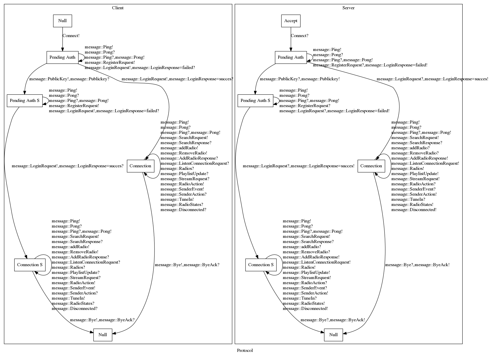

DMP
===

Distributed Music Player

The network protocol
===================

Each message passed over the TCP control connection has the following format

|A network packet| | | | |
|---|---|---|---|---|
| 1 byte | 4 bytes | 1 byte | 4 bytes | size bytes |
| encryption sentinel | possibly encrypted message::Type | encryption sentinel | size of message uint32_t | possibly encrypted message |

* The encryption sentinels are either 0 or 1, for unencrypted and encrypted respectively.
* The Type is a uint32_t which can be casted to a message::Type
* The size of the message is a uint32_t and is the size of the message in bytes.
* The message is a custom Archive format, which serializes structs with boost::fusion.

For the time being all these components are sent separately resulting in 5 network packets. This is somewhat inefficient, it could be reduced quite easily to 1 packet when sending unencrypted and 2 packets when  sending encrypted, due to way messages are currently handled. But it's not a priority until this becomes a performance bottle neck.

The serialization protocol
===================

The Serialization archive format is straight forward. For each member of a struct serialize it members from top to bottom.

If the variable is

* a char, uint8_t int8_t cast it to a wider type and write it to avoid non printable characters.
* any other primitive, write the primitive.
* a string, write the length of the string followed by a *space* and the string itself.
* a container, write  the size_t number of elements in the container followed by a *space* and serialize the elements.
* a pair or tuple, serialize all elements in order, *space* separated.

separate each type you have serialized with a space.

The encryption
===================

DMP uses libsodium for encryption and password hashing for more information regarding the encryption used in the protocol specified above, please refer to [libsodium](https://download.libsodium.org/doc/public-key_cryptography/authenticated_encryption.html)

Building
===================

Requirements:

* CMake 3.20 or newer and a C++17 compiler (GCC 9+, Clang 10+)
* Boost 1.74 or newer (asio, filesystem, program_options, regex, serialization)
* ICU 60 or newer
* TagLib 1.11 or newer (TagLib 2.x is supported)
* GStreamer 1.16 or newer, with the good and ugly plugin sets for mp3 encoding/parsing
* libsodium 1.0.18 or newer
* Qt 6 (Qt 5.15 still works) for the client
* ODB 2.4 or newer with the SQLite backend for the server

Building on Debian / Ubuntu
-------------------

	sudo apt install build-essential cmake ninja-build pkg-config \
		libboost-all-dev libicu-dev libtag1-dev libsodium-dev \
		libgstreamer1.0-dev libgstreamer-plugins-base1.0-dev \
		gstreamer1.0-plugins-good gstreamer1.0-plugins-ugly \
		qt6-base-dev qt6-base-dev-tools \
		odb libodb-dev libodb-sqlite-dev libsqlite3-dev

	cmake -S . -B build -G Ninja
	cmake --build build
	ctest --test-dir build

The `odb` package in Ubuntu 24.04 is built as a GCC 12 plugin, so `g++-12` must be installed as well.

Useful options:

* `-DBUILD_SERVER=OFF` / `-DBUILD_QT_CLIENT=OFF` to build only one side.
* `-DDMP_QT_VERSION=5` to build the client against Qt 5.15 instead of Qt 6.
* `-DUSE_GPERF=ON` to link the gperftools profiler.

Building on macOS
-------------------

	brew install cmake ninja pkgconf boost icu4c taglib qt gstreamer libsodium

	cmake -S . -B build -G Ninja -DBUILD_SERVER=OFF \
		-DCMAKE_PREFIX_PATH="$(brew --prefix qt);$(brew --prefix icu4c)"
	cmake --build build
